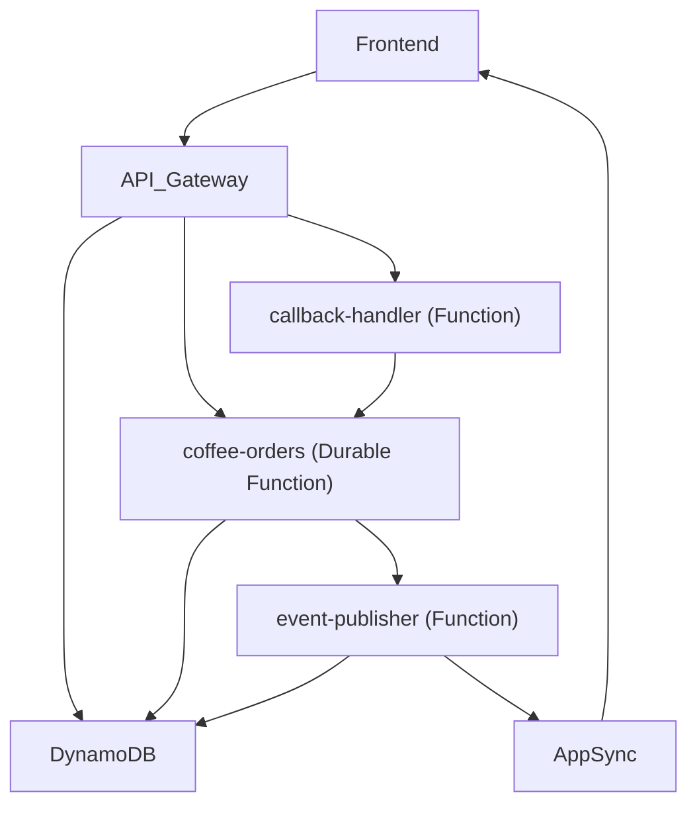

# Durable Serverlesspresso

A rebuild of [Serverlesspresso](https://github.com/aws-samples/serverless-coffee) using [AWS Lambda Durable Functions](https://docs.aws.amazon.com/lambda/latest/dg/durable-functions.html). Built as the demo for the launch of durable functions — a coffee ordering system where the execution pauses while waiting for barista actions and replays from where it left off when they respond.

📺 [Watch the walkthrough](https://youtu.be/XJ80NBOwsow?si=dEbl7sKXm-tuOGPp)

## Architecture

1. Attendee places order → API Gateway → `coffee-orders` durable function starts
2. Function validates order (store open, daily limit) via DynamoDB queries
3. Function publishes `ORDER_PLACED` → EventBridge → `event-publisher` → AppSync → frontend updates
4. Function calls `waitForCallback()` — execution pauses, callback ID stored in DynamoDB
5. Barista clicks Accept → API Gateway → EventBridge → `callback-handler` sends callback success
6. Function resumes, publishes `ORDER_ACCEPTED`, calls `waitForCallback()` again for completion
7. Barista clicks Complete → same callback flow → function finishes with `ORDER_COMPLETED`



## Project Structure

```
├── template.yaml                    # SAM template
├── src/
│   ├── coffee-orders/               # Durable orchestrator function
│   ├── callback-handler/            # Processes barista callbacks via EventBridge
│   ├── event-publisher/             # Publishes to AppSync & updates DynamoDB
│   └── get-execution-history/       # API for execution history lookup
└── frontend/                        # Vue 3 + TypeScript app
```

The durable execution SDK (`@aws/durable-execution-sdk-js`) is installed from npm and bundled by esbuild. The `@aws-sdk/*` packages are marked as external since the Lambda runtime provides them.

## Prerequisites

- AWS SAM CLI (1.153.1+)
- Node.js 22.x+
- AWS credentials configured

## Deploy

### 1. Build and deploy

```bash
sam build
sam deploy --guided
```

### 2. Grab stack outputs

After deploy, save the outputs as shell variables. Set `STACK_NAME` to match your stack. Region comes from your AWS CLI profile:

```bash
STACK_NAME=durable-serverlesspresso

get_output() {
  AWS_PAGER="" aws cloudformation describe-stacks \
    --stack-name $STACK_NAME \
    --query "Stacks[0].Outputs[?OutputKey=='$1'].OutputValue" \
    --output text
}

CONFIG_TABLE=$(get_output ConfigTableName)
ORDERS_TABLE=$(get_output OrdersTableName)
API_URL=$(get_output ApiUrl)
APPSYNC_HTTP=$(get_output AppSyncHttpEndpoint)
APPSYNC_KEY=$(get_output AppSyncApiKey)
FUNCTION_NAME=$(get_output DurableFunctionName)

echo "Config Table:  $CONFIG_TABLE"
echo "Orders Table:  $ORDERS_TABLE"
echo "API URL:       $API_URL"
echo "AppSync HTTP:  $APPSYNC_HTTP"
echo "AppSync Key:   $APPSYNC_KEY"
echo "Function Name: $FUNCTION_NAME"
```

### 3. Seed the config table

The config table needs at least one event record:

```bash
aws dynamodb put-item \
  --table-name $CONFIG_TABLE \
  --item '{
    "eventId": {"S": "coffee-shop"},
    "eventName": {"S": "Coffee Shop"},
    "storeOpen": {"BOOL": true},
    "maxOrdersPerAttendee": {"N": "3"},
    "createdAt": {"S": "'$(date -u +%Y-%m-%dT%H:%M:%S.000Z)'"},
    "updatedAt": {"S": "'$(date -u +%Y-%m-%dT%H:%M:%S.000Z)'"}
  }'
```

### 4. Configure the frontend

```bash
cd frontend
npm install
cp .env.example .env
```

Edit `frontend/.env` with the values from step 2:

```
VITE_API_BASE_URL=<ApiUrl>
VITE_AWS_REGION=<your-region>
VITE_APPSYNC_EVENTS_URL=<AppSyncHttpEndpoint>
VITE_APPSYNC_EVENTS_API_KEY=<AppSyncApiKey>
VITE_EVENT_ID=coffee-shop
```

Start the dev server:

```bash
npm run dev
```

## Local Testing

### Unit tests

```bash
cd src/coffee-orders
npm install
npm test
```

Uses `LocalDurableTestRunner` from `@aws/durable-execution-sdk-js-testing` to run the durable function with mocked DynamoDB and callback responses.

### Local invocation with SAM

When testing locally against cloud resources, create a `locals.json` in the project root (gitignored):

```json
{
  "CoffeeOrdersFunction": {
    "AWS_REGION": "<your-region>",
    "ORDERS_TABLE_NAME": "<OrdersTableName>",
    "CONFIG_TABLE_NAME": "<ConfigTableName>",
    "EVENT_BUS_NAME": "<EventBusName>",
    "APPSYNC_HTTP_ENDPOINT": "<AppSync hostname without https:// or /event>"
  },
  "CallbackHandlerFunction": {
    "AWS_REGION": "<your-region>",
    "ORDERS_TABLE_NAME": "<OrdersTableName>"
  },
  "EventPublisherFunction": {
    "AWS_REGION": "<your-region>",
    "ORDERS_TABLE_NAME": "<OrdersTableName>",
    "CONFIG_TABLE_NAME": "<ConfigTableName>",
    "APPSYNC_EVENTS_API_URL": "<AppSyncHttpEndpoint>",
    "APPSYNC_EVENTS_API_KEY": "<AppSyncApiKey>"
  },
  "GetExecutionHistoryFunction": {
    "AWS_REGION": "<your-region>",
    "COFFEE_ORDERS_FUNCTION": "<DurableFunctionName>"
  }
}
```

Then invoke:

```bash
sam local invoke CoffeeOrdersFunction \
  --event events/order.json \
  --env-vars locals.json \
  --durable-execution-name test-001

# Check execution history
sam local execution history $EXECUTION_ARN

# Simulate barista accepting
sam local callback succeed $CALLBACK_ID \
  --result '{"action": "ACCEPT", "baristaId": "barista-123"}'
```

## Clean Up

```bash
sam delete --stack-name durable-serverlesspresso
```
